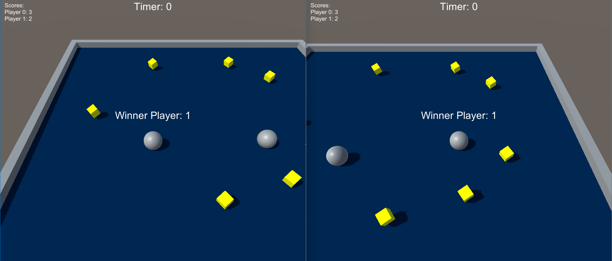

# Roll-a-Ball

For fun I just built up Unity's famous [Roll-a-Ball](https://learn.unity.com/project/roll-a-ball), a beginners tutorial, but with **MULTIPLAYER [(Netcode)](https://docs-multiplayer.unity3d.com/netcode/current/about/)!!!**

    Currently not polished and LAN only is available.

I started from the template [Roll-A-Ball Tutorial (Complete) | URP on the asset store](https://assetstore.unity.com/packages/essentials/tutorial-projects/roll-a-ball-tutorial-complete-urp-77198)